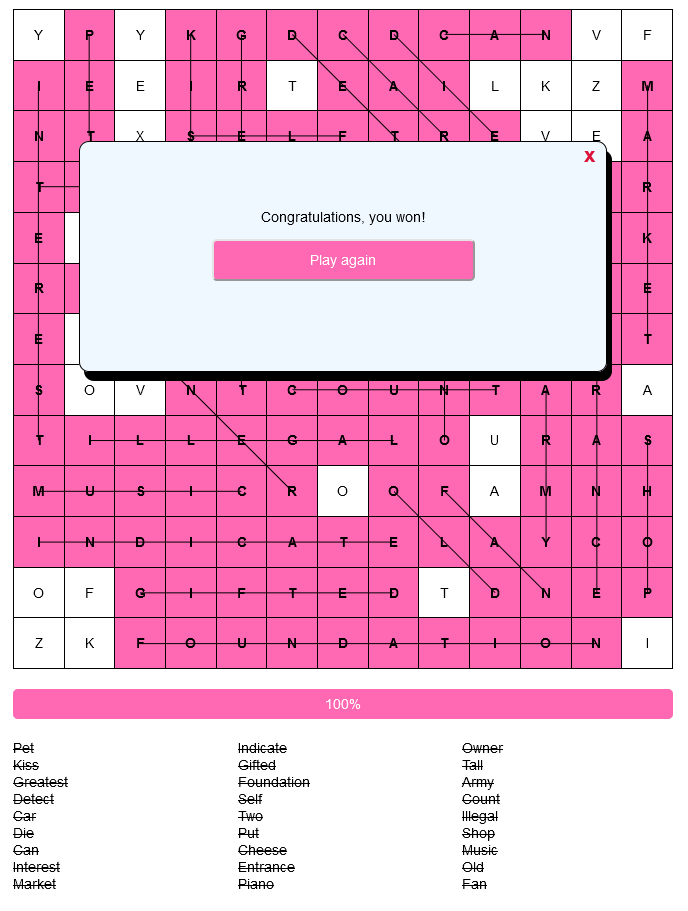
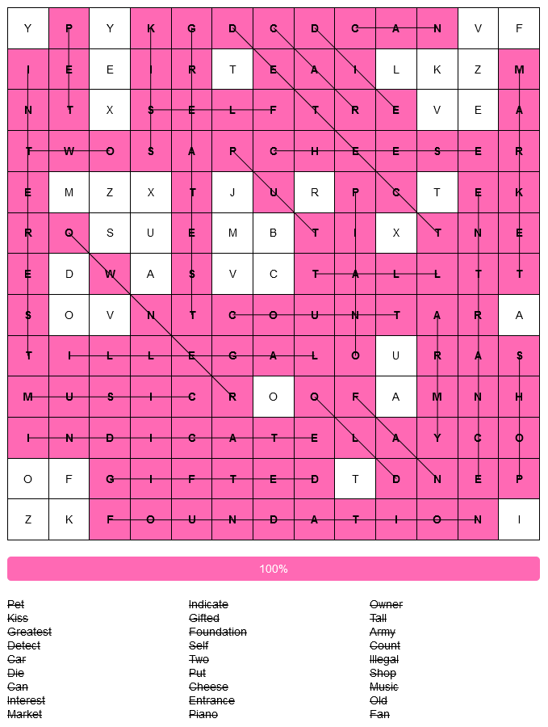

# crossword-web
turns out this is actually called a word searcher.

Lately I have been seeking opportunities to apply the knowledge gained at my studyprogramme MCT. We’ve been getting courses on Fronted, Backend and MySQL.

I have been following some additional courses on C# ASP.NET in my free time as well. However, for this project I opted for Flask. The main reason being that it is familiar. My next web-based project will probably be built around ASP.NET, using Blazor and whatnot. But that is for another time.

For now, the fastest way to start a web-based project, was to take an existing GUI-application and translate it. I chose for the word searcher project I did during the last holiday.

The game board is being generated in the backend, for which I created a separate class. In the frontend, I have a Vanilla JavaScript programme that

    Queries the backend for a playing board
    Displays the board using a html table
    Takes care of all game mechanics

Some styling is applied using css, but that is kept to a minimum. Everything is fully responsive.

I did improve the mechanics quite a bit. In the GUI version, I just hard coded a list of words that came in mind at the time and slapped those on the board. This time around, I scraped the 3000 most used words in the English language from some website. These were stored in a MySQL database.

When prompted to generate a new board, these words were queried and randomized so that every board is more unique and a lot more filled. I would like to build on top of this by categorizing these words, in order to have some sort of coherance or theme in the games. To do so, I sent out some emails for categorized word datasets but did not get any replies yet.

I also adaptively shortened the words I tried to fit on the board in order to fill smaller holes and gaps. This results in a coverage of about 85%, whereas the GUI version got to 60% at best.

